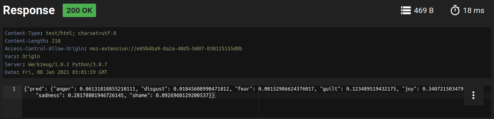
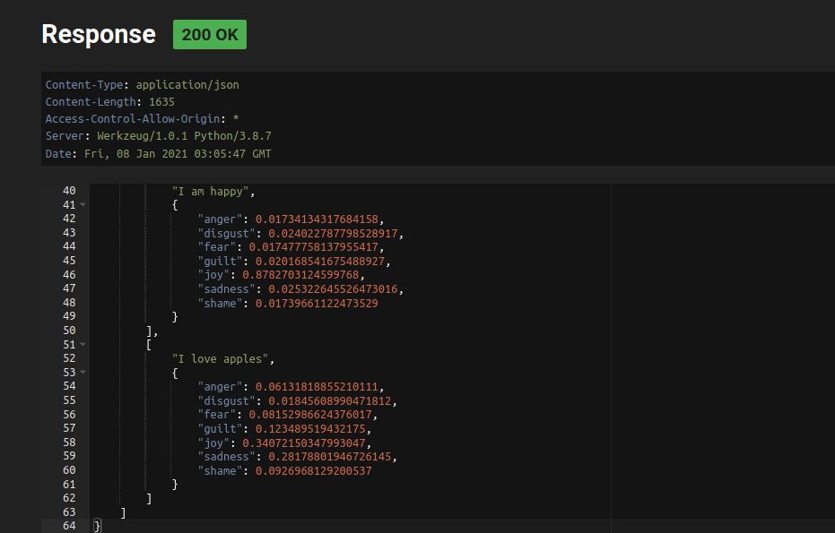

Emotion Recognition 
==============================

This is a multiclass classification problem on emotion recognization. This project is a part of training program at Fusemachines. 

Project Organization
------------

    ├── LICENSE
    ├── README.md          <- The top-level README for developers using this project.
    ├── data
    ├── docs               <- Project analysis and requirements of the project
    ├── models             <- Trained and serialized models, model predictions, or model summaries
    ├── requirements.txt   <- The requirements file for reproducing the analysis environment, e.g.
    │                         generated with `pip freeze > requirements.txt`
    ├── src                <- Source code for use in this project.
    │   ├── __init__.py    <- Makes src a Python module
    │   │
    │   ├── data           <- Scripts to preprocess data
    │   │   └── preprocess_data.py
    │   │
    │   ├── features       <- Scripts to turn raw data/text into vectors for modeling
    │   │   └── vectorize.py
    │   │
    │   ├── models         <- Scripts to train models and then use trained models to make
    │   │   │                 predictions
    │   │   ├── baseline.py
    ├── make_dataset.sh <- Script to download data
    └── app.py <-flask app with mongodb 


--------

Run the Project
==============
```
docker-compose up -d
```

Go to http://127.0.0.1:5000/

For `POST` request:

`Content-Type: application/json`

Body:
```
{
"comment": "I love apples"
}
```

Sample Output:


For `GET` request:

Sample Output:

